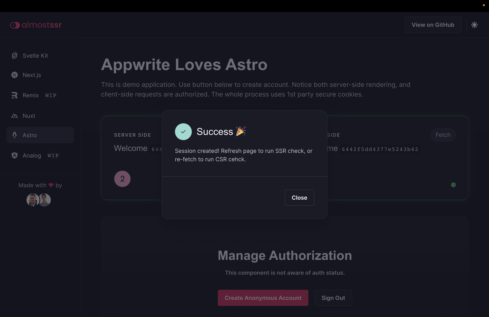

# Almost SSR - Astro

> Demo application with authorized server-side and client-side rendering.

## 👀 Looking for Different Framework?

* [🔦 Svelte Kit](https://github.com/Meldiron/appwrite-ssr-svelte-kit) | [svelte-kit.ssr.almostapps.eu](https://svelte-kit.ssr.almostapps.eu/)
* [🔦 Next.js](https://github.com/Meldiron/appwrite-ssr-next-js) | [next-js.ssr.almostapps.eu](https://next-js.ssr.almostapps.eu/)
* [🔦 Nuxt](https://github.com/Meldiron/appwrite-ssr-nuxt) | [nuxt.ssr.almostapps.eu](https://nuxt.ssr.almostapps.eu/)
* [🔦 Qwik](https://github.com/Meldiron/appwrite-ssr-qwik) | [qwik.ssr.almostapps.eu](https://qwik.ssr.almostapps.eu/)
* [🔦 Remix](https://github.com/Meldiron/appwrite-ssr-remix) | [remix.ssr.almostapps.eu](https://remix.ssr.almostapps.eu/)

## 💭 So How Does It Work?

Appwrite uses 1st party secure cookies for authorization. For legacy reasons, there are two such cookies. They are both very similar, but one's name ends with `_legacy` and is configured a tiny bit differently. It's also possible to use a fallback cookie, but that is not secure for production, and we will not be using that.

To ensure server-side rendering works, we need to set those cookies on our SSR server hostname instead of the Appwrite hostname. Let's say our Appwrite instance is on `cloud.appwrite.io`, and our app is on `myapp.com`. SSR server on domain `myapp.com` won't receive `appwrite.io` cookies. This is expected behavior, as browsers keep 1st party cookies securely scoped to specific domains.

To set those cookies on the SSR server, we need a special API endpoint in our SSR server. This endpoint will send a request to create a session, proxying email/password or other credentials. This endpoint next parses the response `set-cookie` header, replaces domain configuration on the cookies, and set's it's own `set-cookie` on the response to the client.

When a client calls this endpoint, the cookie will now be set on the SSR server hostname instead of the Appwrite hostname.

This makes server-side rendering work, but now client-side rendering is broken. Since `set-cookie` coming to the browser only includes a cookie for the SSR server, talking to the Appwrite server directly won't have a proper cookie - there is no auth cookie on the Appwrite hostname. To overcome this problem, we ensure the Appwrite hostname is a subdomain of the SSR hostname. For example, if our SSR server runs on `myapp.com`, Appwrite needs a custom domain configured on `appwrite.myapp.com`. With this setup, all requests to the Appwrite server will include auth cookies, and the user will be properly authorized. This is possible thanks to Appwrite prefixing the cookie domain with `.`, meaning all subdomains can also access the cookie.

## 🧰 Tech Stack

- [Appwrite](https://appwrite.io/)
- [Astro](https://astro.build/)
- [React](https://react.dev/)
- [Pink Design](https://pink.appwrite.io/)

## 🛠️ Setup Server

1. Setup Appwrite server
2. Create project `almostSsr`

## 👀 Setup Client

1. Install libarries `npm install`
2. Update `AppwriteEndpoint` in `src/pages/AppwriteService.js`
3. Start server `npm run dev`

## 🚀 Deployment

1. Deploy the frontend on your production domain. For example, `myapp.com`.
2. Add the frontend domain as a trusted platform in your Appwrite project.
3. Add a custom domain to your Appwrite project, which is a subdomain of your frontend. For example, `appwrite.myapp.com`.
4. Update `SsrHostname` and `AppwriteHostname` in `src/pages/AppwriteService.js` with proper domains.

## 🤝 Contributing

To contribute to frontend, make sure to use the [Pink Design](https://pink.appwrite.io/) design system. Ensure both dark and light theme work properly, as well as responsivity on mobile, tablet and desktop.

When contributing with static files, ensure all images are in WEBP or SVG format.

## 🖼️ Screenshots




## 🤖 Auto-generated documentation

```
npm create astro@latest -- --template minimal
```

[](https://stackblitz.com/github/withastro/astro/tree/latest/examples/minimal)
[](https://codesandbox.io/p/sandbox/github/withastro/astro/tree/latest/examples/minimal)
[](https://codespaces.new/withastro/astro?devcontainer_path=.devcontainer/minimal/devcontainer.json)

> 🧑‍🚀 **Seasoned astronaut?** Delete this file. Have fun!

## 🚀 Project Structure

Inside of your Astro project, you'll see the following folders and files:

```
/
├── public/
├── src/
│   └── pages/
│       └── index.astro
└── package.json
```

Astro looks for `.astro` or `.md` files in the `src/pages/` directory. Each page is exposed as a route based on its file name.

There's nothing special about `src/components/`, but that's where we like to put any Astro/React/Vue/Svelte/Preact components.

Any static assets, like images, can be placed in the `public/` directory.

## 🧞 Commands

All commands are run from the root of the project, from a terminal:

| Command                | Action                                           |
| :--------------------- | :----------------------------------------------- |
| `npm install`          | Installs dependencies                            |
| `npm run dev`          | Starts local dev server at `localhost:3000`      |
| `npm run build`        | Build your production site to `./dist/`          |
| `npm run preview`      | Preview your build locally, before deploying     |
| `npm run astro ...`    | Run CLI commands like `astro add`, `astro check` |
| `npm run astro --help` | Get help using the Astro CLI                     |

## 👀 Want to learn more?

Feel free to check [our documentation](https://docs.astro.build) or jump into our [Discord server](https://astro.build/chat).
